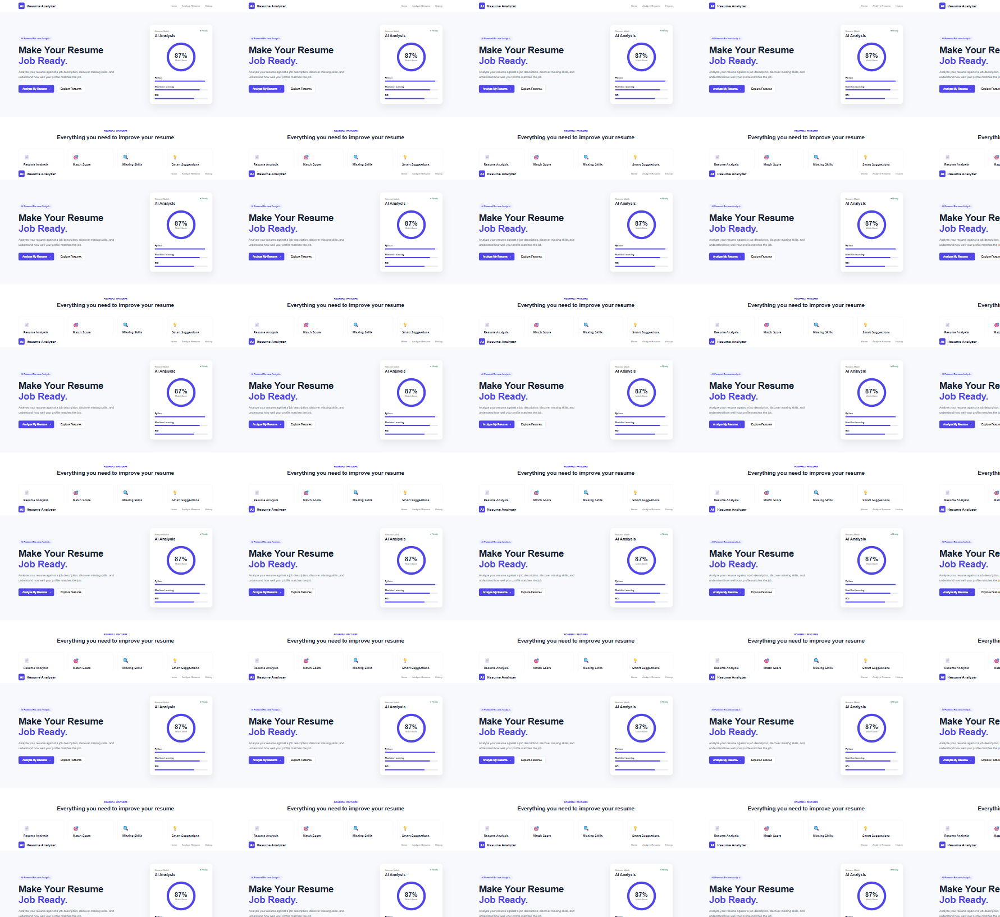
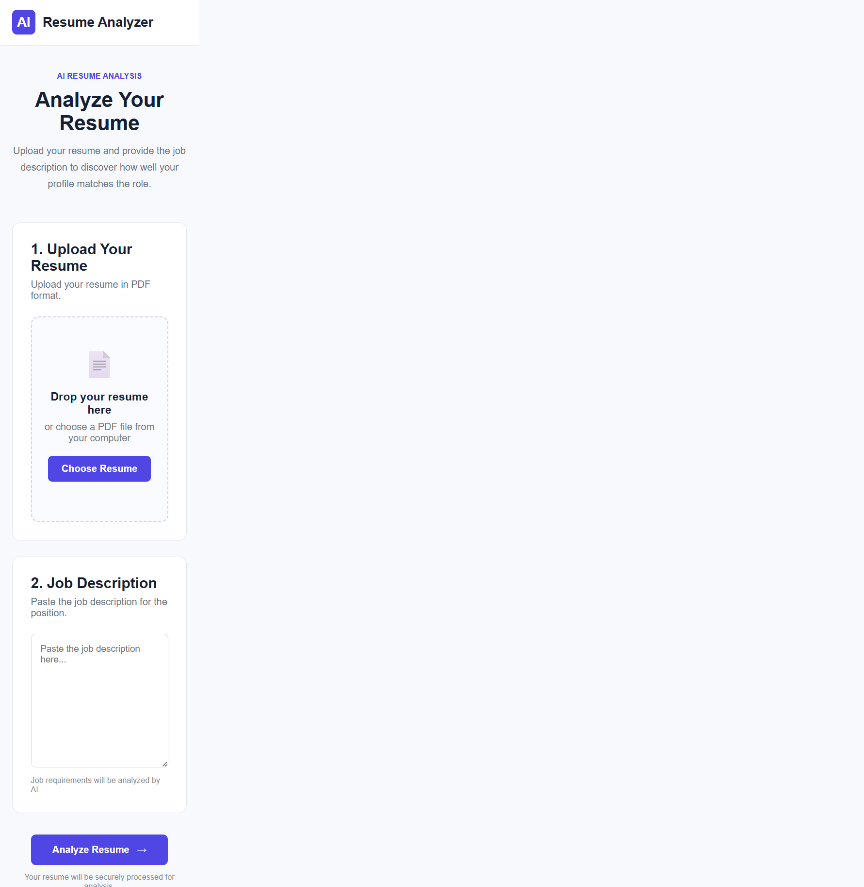
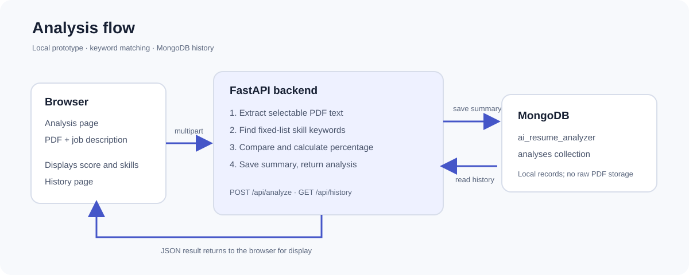

# AI Resume Analyzer

A local web prototype for comparing a PDF resume with a job description. It extracts skills from both texts, reports matching and missing skills, calculates a percentage, and saves analysis summaries to MongoDB.

> **Prototype scope:** Despite the product name and interface copy, this version does not call an AI/LLM service or train a machine-learning model. Its analysis is a deterministic, case-insensitive keyword lookup against a fixed skill vocabulary. Treat its score as a rough demo signal, not a hiring decision or professional assessment.

## Prototype Screenshots

These screenshots show the current frontend. The history screenshot uses synthetic demo data; it does not show records from a local database.

| Home | Resume analysis | Analysis history |
| --- | --- | --- |
|  |  |  |

## Features

- Three static frontend pages: home, resume analysis, and analysis history.
- PDF resume text extraction using `pypdf`.
- Case-insensitive skill detection in the resume and job description.
- Match percentage, matching skills, missing skills, and a basic skills-based suggestion.
- MongoDB persistence for analysis summaries and a history view.
- FastAPI health endpoint and interactive OpenAPI documentation.
- Responsive layouts for desktop and smaller screens.

## How It Works

1. The user selects a PDF and pastes a job description in the analysis page.
2. The browser submits both as multipart form data to `POST /api/analyze`.
3. The backend extracts selectable text from the PDF with `pypdf`.
4. The same fixed vocabulary is searched in the resume text and job description. Detection is case-insensitive substring matching, not semantic analysis.
5. Skills found in both lists are returned as matching skills. Skills found only in the job description are returned as missing skills.
6. The score is `matching required skills / detected required skills * 100`, rounded to two decimal places. If no supported skill is detected in the job description, the score is `0`.
7. The backend saves the analysis summary to MongoDB and returns the result to the browser.
8. The history page requests `GET /api/history` and displays saved summaries.



### Supported Skill Vocabulary

The current list in `backend/services/skill_extractor.py` is: Python, Java, C, C++, JavaScript, HTML, CSS, SQL, MongoDB, MySQL, FastAPI, Flask, Django, Machine Learning, Deep Learning, Artificial Intelligence, Data Science, NumPy, Pandas, Scikit-learn, TensorFlow, PyTorch, NLP, Natural Language Processing, Git, GitHub, REST API, and Data Visualization.

## Technology

- **Frontend:** HTML, CSS, and vanilla JavaScript
- **Backend:** Python, FastAPI, and Uvicorn
- **PDF text extraction:** `pypdf`
- **Persistence:** MongoDB with PyMongo
- **API request parsing:** `python-multipart`

## Project Structure

```text
.
├── backend/
│   ├── main.py                    # FastAPI app, CORS, health route
│   ├── database.py                # MongoDB client and collection
│   ├── routes/
│   │   ├── analysis.py            # POST /api/analyze
│   │   └── resume.py              # GET /api/history
│   └── services/
│       ├── pdf_parser.py          # PDF text extraction
│       ├── skill_extractor.py     # Fixed skill vocabulary and lookup
│       ├── job_analyzer.py        # Job description skill detection
│       └── matcher.py             # Matching, missing skills, score
├── frontend/
│   ├── index.html                 # Home and feature overview
│   ├── analyze.html               # Upload, job description, results
│   ├── history.html               # Saved analysis summaries
│   ├── css/style.css
│   └── js/
│       ├── analyzer.js
│       └── history.js
├── docs/images/                   # Documentation screenshots and diagram
├── tests/                         # Reserved for automated tests
├── uploads/                       # Ignored by Git; keep private files out
├── .gitignore
├── README.md
└── requirements.txt
```

## Requirements

- Python 3.10 or newer is recommended.
- MongoDB Community Server running locally on `mongodb://localhost:27017`.
- A modern browser.

The MongoDB connection string and frontend API URL are currently set directly in the source code. This is a local prototype and is not configured for deployment.

## Run Locally

Run each command from the project root, in separate terminals.

### 1. Create a Python environment and install packages

**Windows PowerShell:**

```powershell
py -m venv .venv
.\.venv\Scripts\Activate.ps1
python -m pip install -r requirements.txt
```

If PowerShell blocks environment activation, use the current user's normal execution-policy guidance or run the virtual environment's Python directly: `.\.venv\Scripts\python.exe -m pip install -r requirements.txt`.

**macOS/Linux:**

```bash
python3 -m venv .venv
source .venv/bin/activate
python -m pip install -r requirements.txt
```

### 2. Start MongoDB

Start the local MongoDB service and leave it running. The application uses database `ai_resume_analyzer` and collection `analyses`; MongoDB creates them when the first analysis is saved.

### 3. Start the API

```bash
python -m uvicorn backend.main:app --reload
```

The API is available at `http://127.0.0.1:8000`. Check `http://127.0.0.1:8000/api/health` for a health response and open `http://127.0.0.1:8000/docs` for interactive API documentation.

### 4. Serve the frontend

In another terminal, from the project root:

```bash
python -m http.server 5501 --directory frontend
```

Open `http://127.0.0.1:5501`. Alternatively, use the VS Code Live Server extension; this workspace's local setting uses port `5501`.

The backend must remain running while using analysis or history. The frontend currently calls `http://127.0.0.1:8000` directly.

## API

| Method | Path | Purpose |
| --- | --- | --- |
| `GET` | `/` | API running message |
| `GET` | `/api/health` | Basic process health check |
| `POST` | `/api/analyze` | Analyze a PDF and job description; multipart fields: `resume` (PDF file) and `job_description` (text) |
| `GET` | `/api/history` | Return saved analysis summaries, newest first |
| `GET` | `/docs` | Interactive Swagger UI generated by FastAPI |

The analysis response includes `success`, `filename`, `resume_skills`, `required_skills`, `matching_skills`, `missing_skills`, and `match_percentage`. History records include the filename, job description, detected skill lists, and match percentage.

## Data and Privacy

- The raw PDF is parsed for the request and is **not saved by this implementation**.
- The filename, complete job description, detected resume/job skills, matching skills, missing skills, and percentage are saved in the local MongoDB collection.
- There is no sign-in, access control, per-user history separation, retention policy, or delete operation. The history endpoint returns all records in the configured database.
- Do not upload real or confidential resumes to a publicly accessible deployment. Do not commit resumes, database exports, credentials, or private user data.
- The screenshots in this repository are sanitized; the history capture contains synthetic sample content.

## Known Limitations

- Only selectable text in PDFs is read. Scanned/image-only PDFs need OCR, which is not implemented.
- Skill detection uses substring matching and a fixed vocabulary. It can miss synonyms and context, and can produce false matches (for example, short skill names such as `C`).
- The score considers only detected vocabulary items, not experience, proficiency, seniority, or job importance. It is not a measure of candidate quality.
- Suggestions simply repeat missing skills; they are not generated by an AI model.
- The homepage's `87%` score is static illustrative content, not a result from the backend.
- Upload size/type validation, robust error reporting, authentication, and automated tests are not implemented.
- CORS currently allows requests from any origin. Keep this app local during development; deployment requires security and configuration work.
- The API URL and MongoDB URL are hard-coded for local development.

## Tests

There are currently no automated tests in `tests/`. The basic manual smoke check is to open `/api/health`, submit a sample PDF and job description through the analysis page while MongoDB is running, and confirm the result appears on the history page.

## GitHub Publishing Checklist

1. Review the screenshots and README for private information before publishing.
2. Confirm `.gitignore` excludes virtual environments, local uploads, environment files, and generated Python files.
3. Choose a repository visibility that matches your privacy needs. This project currently has no `LICENSE` file, so do not assume others have permission to reuse it.
4. Initialize Git, create or select a GitHub repository, add its remote, and push the branch. Git is not bundled with this project.